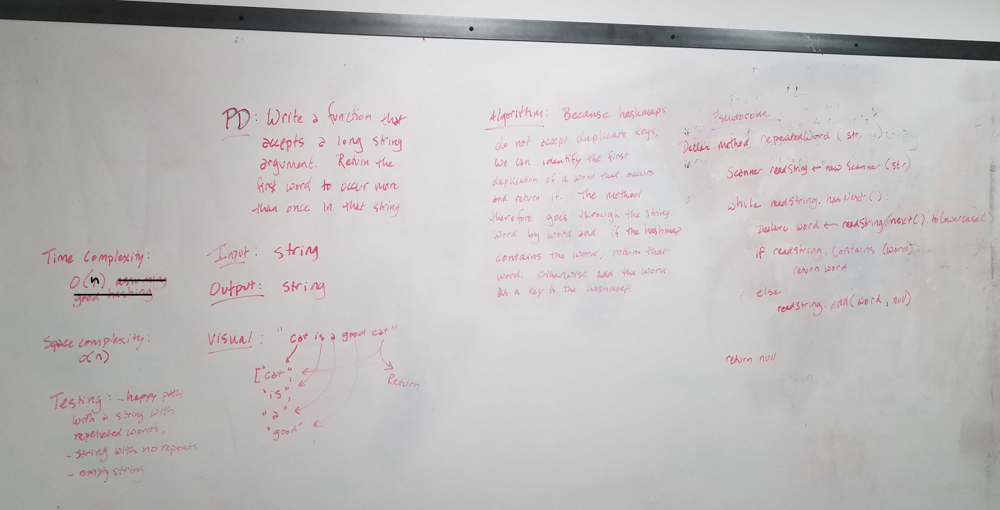

# About 
Includes Code challenges from Two Code Fellows courses - Code301-d50 course and from Code401-Java-d6. All descriptions of code challenges that follow are from Code401 Java.

# Contributor
Sharina Stubbs

# Contents
[Arrays](/Users/sharina/codefellows/401Java/data-structures-and-algorithms/code401Challenges/src/main/java/code401Challenges/ARRAYS.MD)

[Graphs](https://github.com/SharinaS/data-structures-and-algorithms/tree/master/code401Challenges/src/main/java/code401Challenges/graph)

[Hashtables](https://github.com/SharinaS/data-structures-and-algorithms/tree/master/code401Challenges/src/main/java/code401Challenges/hashtable)

[Linked Lists](https://github.com/SharinaS/data-structures-and-algorithms/blob/master/code401Challenges/src/main/java/code401Challenges/linkedlist/README_LINKEDLIST.MD)

[Sorting Algorithms](/Users/sharina/codefellows/401Java/data-structures-and-algorithms/code401Challenges/src/main/java/code401Challenges/sort/README_SORTING.MD)

[Stacks and Queues](/Users/sharina/codefellows/401Java/data-structures-and-algorithms/code401Challenges/src/main/java/code401Challenges/stacksandqueues/README_STACKSQUEUES.MD)

[Strings](https://github.com/SharinaS/data-structures-and-algorithms/tree/master/code401Challenges/src/main/java/code401Challenges/string)

[Trees](https://github.com/SharinaS/data-structures-and-algorithms/tree/master/code401Challenges/src/main/java/code401Challenges/tree)
 

 

# Hashtables
## The class [hashtable](https://github.com/SharinaS/data-structures-and-algorithms/tree/master/code401Challenges/src/main/java/code401Challenges/hashtable) includes a variety of methods. 

The following four methods have a Time Complexity of O(1), and a Space Complexity of O(1):

* add()
  * Takes in both the key and value. This method hashes the key, and adds the key and value pair to the table, handling collisions as needed.
* get()
  * Takes in the key and returns the value from the table.
* contains()
  * Takes in the key and returns a boolean, indicating if the key exists in the table already.
* hash()
  * Takes in an arbitrary key and returns an index in the collection.

## Repeated Word
The class [RepeatedWord](https://github.com/SharinaS/data-structures-and-algorithms/blob/master/code401Challenges/src/main/java/code401Challenges/hashtable/RepeatedWord.java) checks a lengthy string to find the first word that is repeated. It then repeats that word. 

Finding the first word that is repeated is done with my own hashtable class, versus the built in Java class.

## TreeIntersection
[TreeIntersection](https://github.com/SharinaS/data-structures-and-algorithms/blob/master/code401Challenges/src/main/java/code401Challenges/hashtable/TreeIntersection.java) is a class that contains methods that find common values within two binary trees. Hashmap and Tree are two classes used to solve this coding challenge. 

## LeftJoin
The class [LeftJoin](https://github.com/SharinaS/data-structures-and-algorithms/blob/master/code401Challenges/src/main/java/code401Challenges/hashtable/LeftJoin.java) includes a function that LEFT JOINs two hashmaps into a single data structure.
The first parameter is a hashmap that has word strings as keys, and a synonym of the key as values.
The second parameter is a hashmap that has word strings as keys, and antonyms of the key as values.
The code combines the key and corresponding values (if they exist) into a new data structure according to LEFT JOIN logic.
* LEFT JOIN means all the values in the first hashmap are returned, and if values exist in the “right” hashmap, they are appended to the result row. If no values exist in the right hashmap, then some flavor of NULL should be appended to the result row.

Time Complexity: O(n)
Space Complexity: O(n)

Data Structures used in this problem:
* Hashtable (my own class)
* Array
* ArrayList

