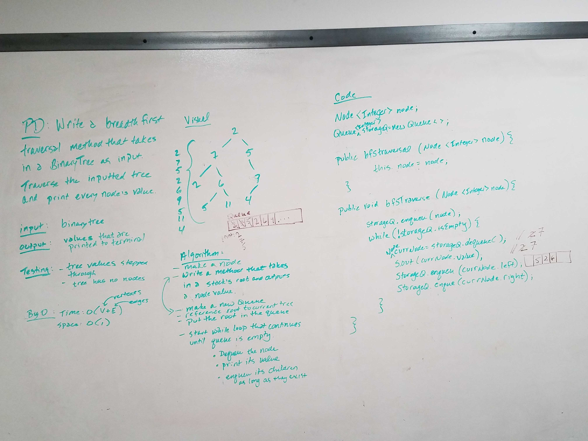
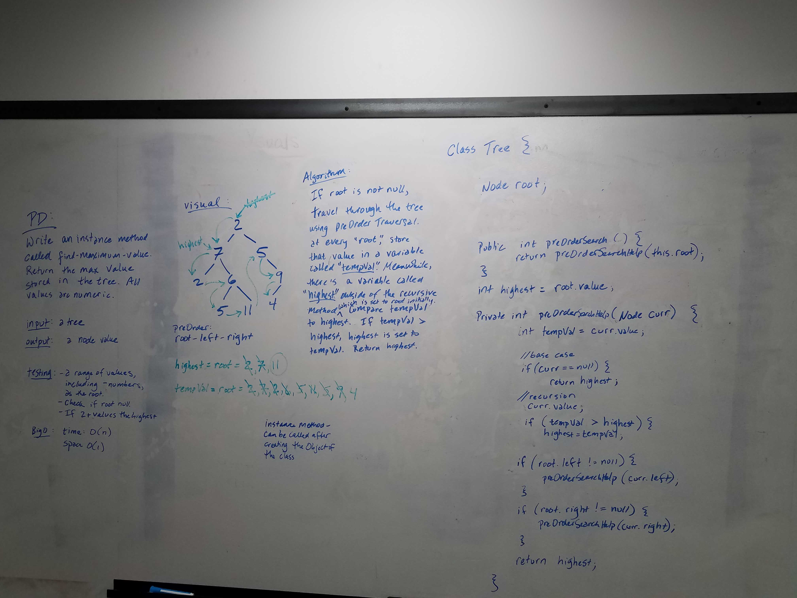
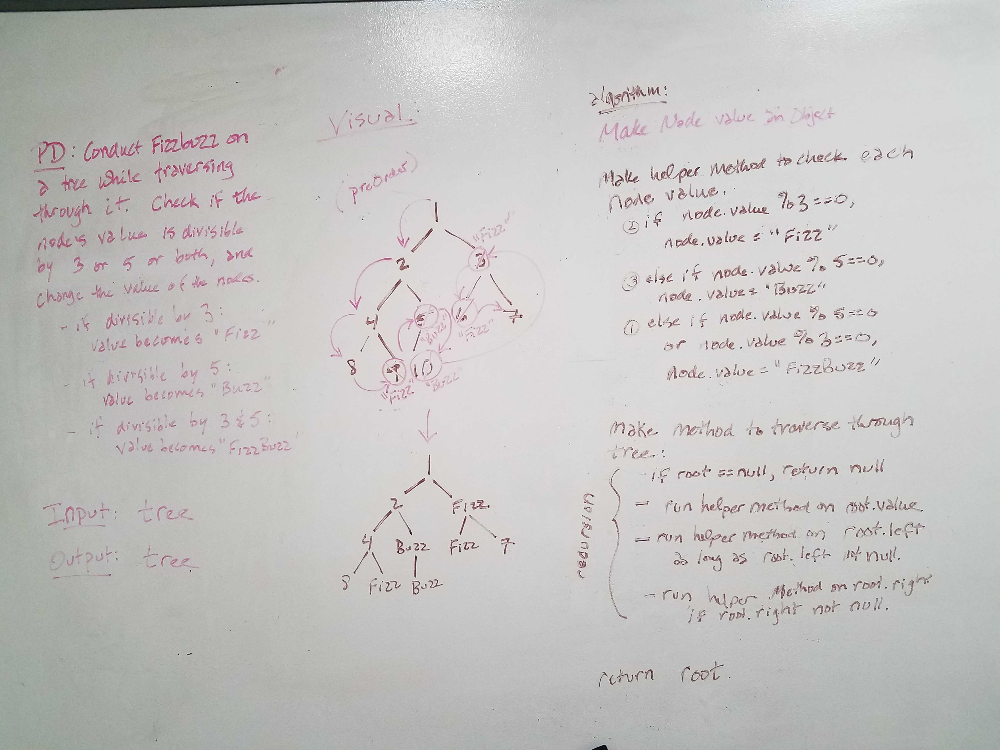

# Data Structures and Algorithms
Includes Code challenges from Code301d50 course and from Code401Javad6. All descriptions of code challenges that follow are from Code401 Java.

## Contributor
Sharina Stubbs

# [Sorting Algorithms](https://github.com/SharinaS/data-structures-and-algorithms/tree/master/code401Challenges/src/main/java/code401Challenges/sort)
Read about the algorithms: [The Blog](https://github.com/SharinaS/data-structures-and-algorithms/blob/master/code401Challenges/src/main/java/code401Challenges/sort/BLOG.MD)
* [Insertion Sort](https://github.com/SharinaS/data-structures-and-algorithms/blob/master/code401Challenges/src/main/java/code401Challenges/sort/InsertionSort.java)
* [Merge Sort](https://github.com/SharinaS/data-structures-and-algorithms/blob/master/code401Challenges/src/main/java/code401Challenges/sort/MergeSort.java)
* [Quick Sort](https://github.com/SharinaS/data-structures-and-algorithms/blob/master/code401Challenges/src/main/java/code401Challenges/sort/QuickSort.java)

# Data Structures:
* [Reverse Array](https://github.com/SharinaS/data-structures-and-algorithms/blob/master/code401Challenges/src/main/java/code401Challenges/ArrayReverse.java)
* [Array Shift](https://github.com/SharinaS/data-structures-and-algorithms/blob/master/code401Challenges/src/main/java/code401Challenges/ArrayShift.java)
* [Binary Search](https://github.com/SharinaS/data-structures-and-algorithms/blob/master/code401Challenges/src/main/java/code401Challenges/BinarySearch.java)
* [Linked List](https://github.com/SharinaS/data-structures-and-algorithms/tree/master/code401Challenges/src/main/java/code401Challenges/linkedlist) 
* [Stacks and Queues](https://github.com/SharinaS/data-structures-and-algorithms/tree/master/code401Challenges/src/main/java/code401Challenges/stacksandqueues)
* [Utilities - contains Animal Shelter, MultiBracket Validation, and FizzBuzzTree](https://github.com/SharinaS/data-structures-and-algorithms/tree/master/code401Challenges/src/main/java/code401Challenges/utilities)
* [PseudoQueue](https://github.com/SharinaS/data-structures-and-algorithms/tree/master/code401Challenges/src/main/java/code401Challenges/stacksandqueues)
* [Trees](https://github.com/SharinaS/data-structures-and-algorithms/tree/master/code401Challenges/src/main/java/code401Challenges/tree)

# [Arrays Code Challenges](https://github.com/SharinaS/data-structures-and-algorithms/tree/master/code401Challenges/src/main/java/code401Challenges)
* reverseArray()
* arrayShift()
* binarySearch()

## Reverse Array
Write a function called reverseArray that takes an array as an argument and returns an array with elements in reversed order. Avoids any built-in language specific methods.

### Approach & Efficiency
I decided to approach this problem with creating a new array, instead of the other option I had considered, which was to change the array in place. I chose the new array approach since it made the most sense to me initially, however creating a new array would sacrifice memory. 

Big 0 time - O(n)
Big 0 space - 0(n)

### Solution

## Array Shift
Whiteboarding done with Ahren Swett. Actual code written solo by Sharina Stubbs.

### Challenge
Write a function called ArrayShift that takes an array and a number. Output is a new array that includes that number added to the middle of the original array. Avoids any built-in language specific methods.

### Approach & Efficiency
I approached this problem by identifying the middle index of the original array, and I made a new array. I iterated through the original array up until the point of the middle index, at which point the input number was added to that middle index location. The iteration continued after the middle index with adding in the rest of the original array elements to the new array. 
Big 0 time - O(n)
Big 0 space - 0(n)

### Solution

## Binary Search
Whiteboarding done with Jon Veach. Code written by Sharina Stubbs.

### Challenge
Write a function called BinarySearch which takes in 2 parameters: a sorted array and the search key. Without utilizing any of the built-in methods available to your language, return the index of the array’s element that is equal to the search key, or -1 if the element does not exist.

### Approach & Efficiency
Given the sorted array, my approach was to find the middle of the array, then check to see if the element at the middle matched the key. If it did, then the program simply returned the index of that element. If not, we check if the key is greater than or less than the midpoint, so we can ultimately reset the bounds of array that is searched to either the last half or the first half of the searched array, respectively. We repeat this entire process over and over again using a while loop until either the entire array has been searched, or the key has been found. 
Big 0 time - O(n)
Big 0 space - 0(n)

### Solution

# [Linked List Code Challenges](https://github.com/SharinaS/data-structures-and-algorithms/tree/master/code401Challenges/src/main/java/code401Challenges/linkedlist)
Linked List contains these methods:
* insertAtHead()
* toString()
* includes()
* insertAtEnd()
* insertBefore()
* insertAfter()
* runningBackwards()
* mergeLists()

## Linked List
Create a Node class that has properties for the value stored in the Node, and a pointer to the next Node. Within the LinkedList class, there is a head property. Upon instantiation, an empty Linked List should be created.

## Linked List Methods
### InsertAtHead()
Adds a value to the linked list at the beginning of the list. More specifically, it takes any value as an argument and adds a new node with that value to the head of the list with an O(1) Time performance.

### toString()
Takes the linked list values and outputs them as a string. toString() takes in no arguments and returns a string representing all the values in the Linked List.

### includes()
Checks the values of the linked list for a particular value. Specifically, it takes any value as an argument and returns a boolean result depending on whether that value exists as a Node’s value somewhere within the list.

### append()
adds a new node with the given value to the end of the list

### insertBefore()
 add a new node with the given newValue immediately before the first value node

### insertAfter()
 add a new node with the given newValue immediately after the first value node

### Whiteboarding of append(), insertBefore() and insertAfter()

### runningBackwards()
A method for the Linked List class which takes a number, k, as a parameter. The output is the node’s value that is k from the end of the linked list. 

### MergeLists()
In place merge of two linked lists that uses a while loop to iterate through the lists. Pointers and temp variable(s) are used to point from node to node, to essentially combine the two lists. This was a pair-programming whiteboarding with Sarah Fisher.

# [Stacks and Queues Code Challenges](https://github.com/SharinaS/data-structures-and-algorithms/tree/master/code401Challenges/src/main/java/code401Challenges/stacksandqueues)
Work is found within the package "stacksandqueues", and includes a node class, a queue class, a stack class, and a pseudoqueue class.

Stack Methods:
* push();
* pop();
* peep();
* isEmpty();

Queue Methods:
* enqueue();
* dequeue();
* peep();
* isEmpty();

PseudoQueue Methods:
* enqueue();
* dequeue();
* peep();

## Challenge: Build Stack and QueueClasses
Create methods for stack and queue classes that remove and add data to the stack or list:

### Stack:
From the challenge description: "This object should be aware of a default empty value assigned to top when the stack is created. Define a method called push which takes any value as an argument and adds a new node with that value to the top of the stack with an O(1) Time performance. Define a method called pop that does not take any argument, removes the node from the top of the stack, and returns the node’s value. Define a method called peek that does not take an argument and returns the value of the node located on top of the stack, without removing it from the stack."

* Push is O(1) time performance
* Pop is O(1) time performance

### Queue:
From the challenge description: "This object should be aware of a default empty value assigned to front when the queue is created. Define a method called enqueue which takes any value as an argument and adds a new node with that value to the back of the queue with an O(1) Time performance. Define a method called dequeue that does not take any argument, removes the node from the front of the queue, and returns the node’s value. Define a method called peek that does not take an argument and returns the value of the node located in the front of the queue, without removing it from the queue."

* Enqueue is O(1) time performance
* Dequeue is O(1) time performance

## Challenge: Build a PseudoCode Class
From the challenge descriptions: "... this PseudoQueue class will implement our standard queue interface (the two methods listed below), but will internally only utilize 2 Stack objects."

### Implementation
To enqueue, one can push a value directly to stack1. To dequeue, the stack must be reversed, so a second stack is used to do this. Once the stack is reversed, the top item is popped, thus returning the item. 
* O(1) time to enqueue a value
* O(n) time to dequeue a value

### Algorithm and pseudocode

## Challenge: [Build an Animal Shelter Class](https://github.com/SharinaS/data-structures-and-algorithms/blob/master/code401Challenges/src/main/java/code401Challenges/utilities/AnimalShelter.java)
Challenge description: "Create a class called AnimalShelter which holds only dogs and cats. The shelter operates using a first-in, first-out approach. Implement the following methods - enqueue(animal: adds animal to the shelter. animal can be either a dog or a cat object. dequeue(pref): returns either a dog or a cat. If pref is not "dog" or "cat" then return null."

### Whiteboarding:

## Multi-Bracket Validation
Your function should take a string as its only argument, and should return a boolean representing whether or not the brackets in the string are balanced. There are 3 types of brackets:

* Round Brackets : ()
* Square Brackets : []
* Curly Brackets : {}

Examples:
* {}	TRUE
* {}{Code}[Fellows](())	TRUE
* {(})	FALSE
* [({}]	FALSE

### Algorithm
The algorithm I implemented in my code uses a stack to store all open brackets. For each iteration through the string, the potential mate of the bracket stored in the stack is compared to the top of the stack. If there's a match, the bracket in the stack is popped. What should be left is an empty stack. If not, there's an unclaimed bracket in the stack, and so the algorithm returns false.

Big O:
* Time: O(1)  
* Space: O(n) <---- ?

### Whiteboarding
I created an algorithm for this code challenge during my whiteboarding that I decided not to implement. When I started coding, I realized that using a stack would be easier to implement. 

# [Trees Code Challenges](https://github.com/SharinaS/data-structures-and-algorithms/tree/master/code401Challenges/src/main/java/code401Challenges/tree)

## Methods in the Tree Package
Recursion heavily relied upon for the following classes.
### [Binary Search Tree Class](https://github.com/SharinaS/data-structures-and-algorithms/blob/master/code401Challenges/src/main/java/code401Challenges/tree/BinarySearchTree.java)
* add();
* contains();

### [Binary Tree Class](https://github.com/SharinaS/data-structures-and-algorithms/blob/master/code401Challenges/src/main/java/code401Challenges/tree/Tree.java)
* preOrder();
* inOrder();
* postOrder();
* breadthfirstTraverse();
* findMaxValue();

**BreadthFirstTraverse** is a method in the Binary Tree Class that prints out values of a binary tree. It is implemented using a queue (from this repo's queue class) and a while loop. It takes in a tree, and outputs integers. 

**FindMaxValue** is an instance method in the Binary Tree Class that returns the maximum value stored in the tree. You can assume that the values stored in the Binary Tree will be numeric. There are two variables that keep track of the current highest value, and the highest value found thus far. The method is built using recursion to do a pre-order traversal of the tree.

## [FizzBuzzTree](https://github.com/SharinaS/data-structures-and-algorithms/blob/master/code401Challenges/src/main/java/code401Challenges/utilities/FizzBuzzTree.java)
FizzBuzzTree class is actually contained within the Utilites Package, however it is built with a tree in mind, therefore it is lumped with Trees.

### Problem Domain:
Write a function called FizzBuzzTree which takes a tree as an argument.
Without utilizing any of the built-in methods available to your language, determine weather or not the value of each node is divisible by 3, 5 or both, and change the value of each of the nodes:
* If the value is divisible by 3, replace the value with “Fizz”
* If the value is divisible by 5, replace the value with “Buzz”
* If the value is divisible by 3 and 5, replace the value with “FizzBuzz”

Return the tree with its new values.

### Efficiency for FizzBuzzTree:
* Time complexity: O(n)
* Space complexity: O(1)

### Whiteboarding image:

